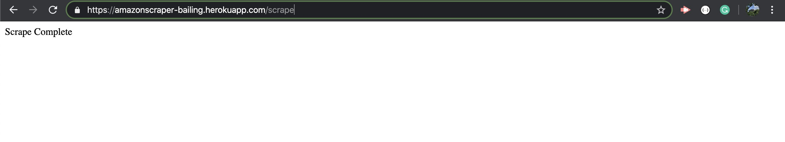
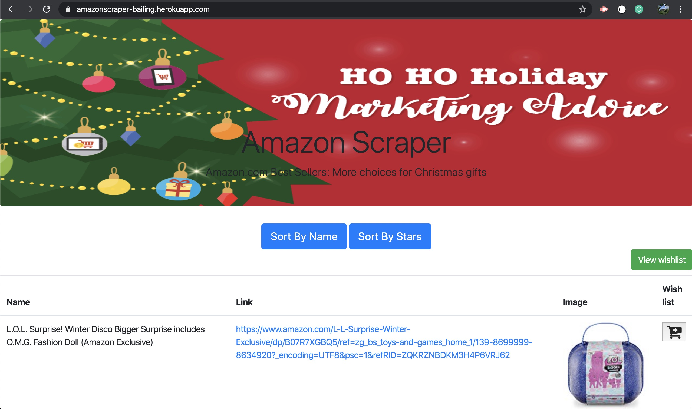
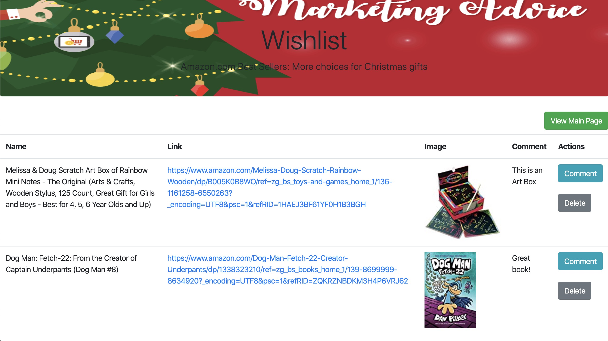

# Amazon-Scraper-Mongo

## Deployment

Heroku Link: https://amazonscraper-bailing.herokuapp.com/

## How it Works

* Add "/scrape" in the URL to crawl Amazon Gift Sale website information

* Add favorite products to your wish list

* In the wish list, products can be commented and deleted

## Technologies used

* Node.js

* Express.js

* Handlebars.js

* MongoDB

* cheerio